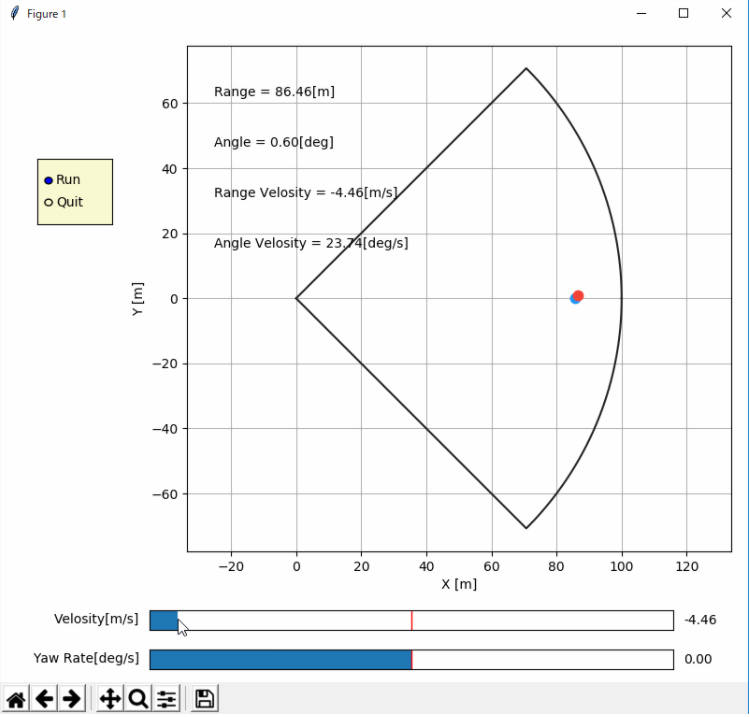
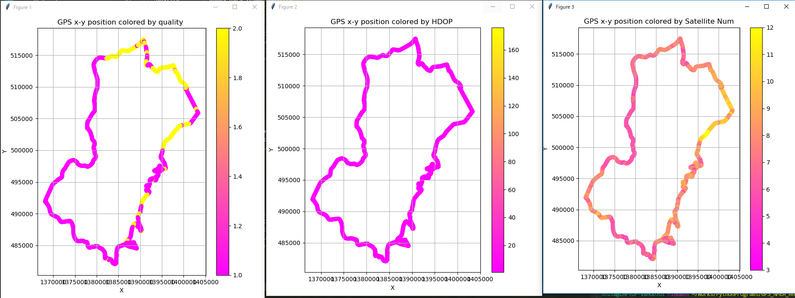
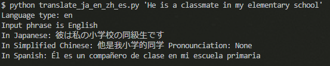
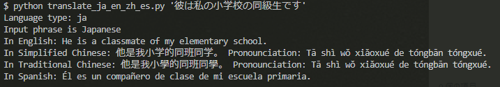
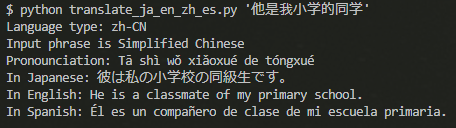
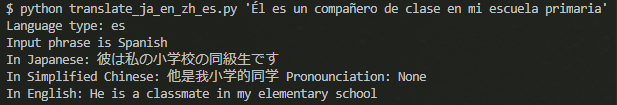
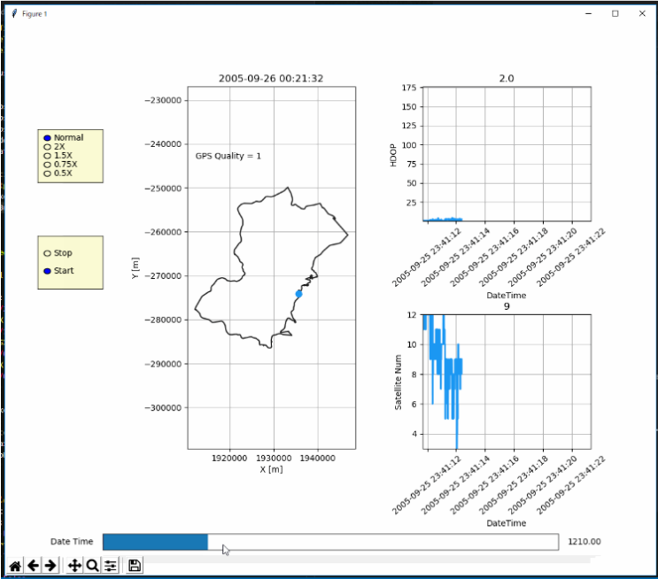
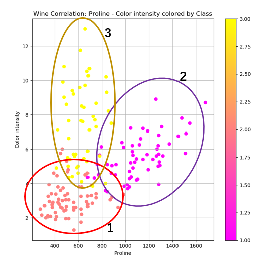
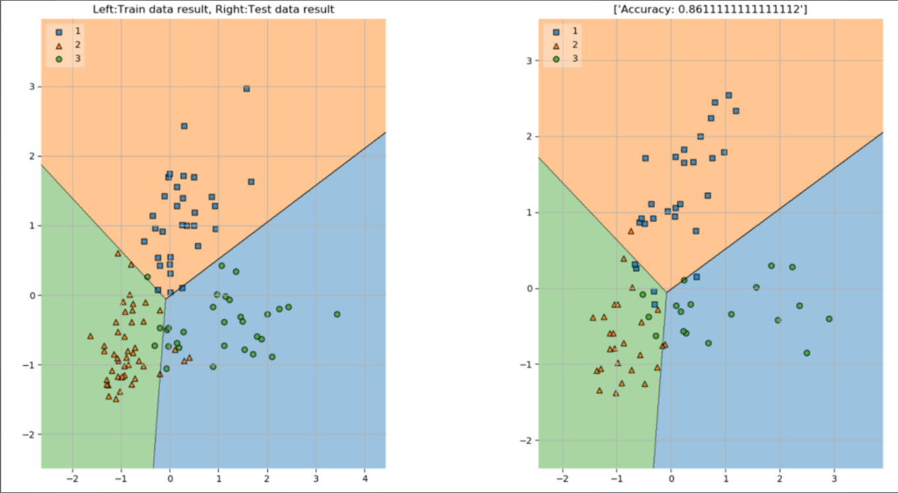

# PythonPrograms
Code collections to study Python programming.  

## Table of contents

* [Directories list](#directories-list)
    * [ObjectSensingSimulator](#objectsensingsimulator)
    * [GPS_NMEA_Analysis](#gps_nmea_analysis)
    * [Chinese_Learning](#chinese_learning)
    * [Animation_Player](#animation_player)
    * [Analysis_Origine_Wine](#analysis_origine_wine)
* [License](#license)
* [Author](#author)

## Directories list

### ObjectSensingSimulator
* [ObjectSensingSimulator](https://github.com/ShisatoYano/PythonPrograms/tree/master/ObjectSensingSimulator)
* Fisrt code I wrote by Python.  
* Simulate radar object sensing.
* Motion model input can be operated by Slider GUI

### GPS_NMEA_Analysis
* [GPS_NMEA_Analysis](https://github.com/ShisatoYano/PythonPrograms/tree/master/GPS_NMEA_Analysis)
* Convert from Longitude-Latitude to X-Y position by using pyproj.
* Create X-Y position heatmap colored by some kinds of data.

### Chinese_Learning
* [Chinese_Learning](https://github.com/ShisatoYano/PythonPrograms/tree/master/Chinese_Learning)
* 4 languages translation tool by Google translation API, py-translator.
* Translate from English to Japanese, Spanish and Chinese.

* Translate from Japanese to English, Spanish and Chinese.

* Translate from Chinese to Japanese, Spanish and English.

* Translate from Spanish to Japanese, English and Chinese.

### Animation_Player
* [Animation_Player](https://github.com/ShisatoYano/PythonPrograms/tree/master/Animation_Player)
* GUI to playback time series data.
* Playback speed and start/stop can be controlled.  

### Analysis_Origine_Wine
* [Analysis_Origine_Wine](https://github.com/ShisatoYano/PythonPrograms/tree/master/Analysis_Origine_Wine)
* Learning and predicting class of wine by using SVM classification.
* Analysis about correlation of data.  

* Prediction redult by SVM classification.  

## License
MIT  

## Author
* [Shisato Yano](https://github.com/ShisatoYano) ([@4310sy](https://twitter.com/4310sy))